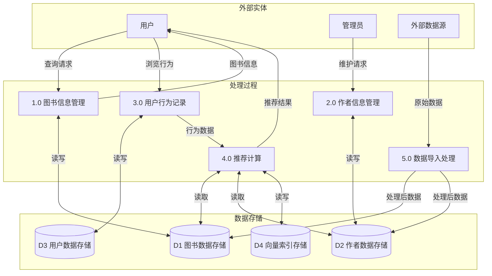
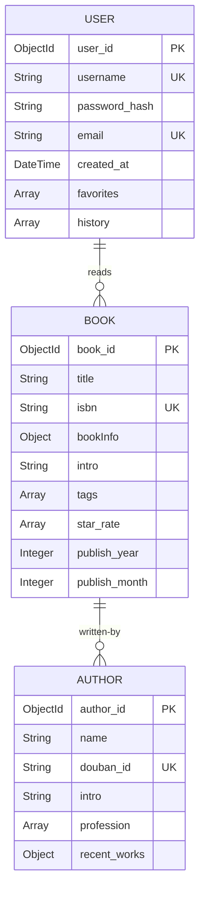

# 基于MongoDB的图书信息管理系统数据库设计与实现

## 摘要

本项目设计并实现了一个基于MongoDB文档数据库的图书信息管理系统。系统采用文档型数据库存储结构，通过嵌入式文档和引用相结合的方式处理复杂的实体关系，并利用向量数据库技术实现智能推荐功能。本报告从数据库设计的角度，详细阐述了系统的需求分析、概念设计、逻辑设计、物理设计和实现过程。

## 1. 需求分析

### 1.1 系统概述

图书信息管理系统需要管理大量的图书数据、作者信息以及用户行为数据。系统的核心需求包括：
- 高效存储和检索海量图书信息
- 维护作者与图书之间的复杂关联关系
- 记录和分析用户行为数据
- 基于内容和行为的智能推荐

### 1.2 数据流图



### 1.3 数据字典

#### 1.3.1 数据项定义

**图书相关数据项**

| 数据项名 | 含义说明 | 别名 | 数据类型 | 长度 | 取值范围 | 取值含义 | 逻辑关系 |
|----------|----------|------|----------|------|----------|----------|----------|
| book_id | 图书唯一标识符 | 图书ID | ObjectId | 12字节 | 系统自动生成 | MongoDB对象ID | 主键，唯一 |
| book_title | 图书标题 | 书名 | String | 1-200 | 任意文本 | 图书的正式名称 | 不可为空 |
| book_isbn | 国际标准书号 | ISBN | String | 13-17 | 符合ISBN格式 | 图书的国际标识码 | 唯一约束 |
| publish_year | 出版年份 | - | Integer | 4 | 1900-当前年份 | 图书出版的年份 | 需验证合理性 |
| publish_month | 出版月份 | - | Integer | 2 | 1-12 | 图书出版的月份 | 依赖于publish_year |
| book_price | 图书定价 | 定价 | String | 1-20 | 数字+货币单位 | 图书的标价 | 可包含货币符号 |
| page_count | 页数 | - | String | 1-10 | 正整数 | 图书的总页数 | 可为空 |
| star_rate_dist | 评分分布 | 星级分布 | Array[Float] | 5 | 0.0-1.0 | 各星级评分占比 | 总和为1.0 |

**作者相关数据项**

| 数据项名 | 含义说明 | 别名 | 数据类型 | 长度 | 取值范围 | 取值含义 | 逻辑关系 |
|----------|----------|------|----------|------|----------|----------|----------|
| author_id | 作者唯一标识符 | - | ObjectId | 12字节 | 系统自动生成 | MongoDB对象ID | 主键，唯一 |
| author_name | 作者姓名 | 作者名 | String | 1-100 | 任意文本 | 作者的姓名 | 不可为空 |
| author_intro | 作者简介 | 简介 | String | 0-5000 | 任意文本 | 作者的介绍信息 | 可为空 |
| douban_id | 豆瓣作者ID | - | String | 1-20 | 数字字符串 | 外部系统标识 | 唯一约束 |
| profession_list | 职业列表 | 职业 | Array[String] | 0-10 | 预定义职业表 | 作者的职业标签 | 可为空数组 |

**用户相关数据项**

| 数据项名 | 含义说明 | 别名 | 数据类型 | 长度 | 取值范围 | 取值含义 | 逻辑关系 |
|----------|----------|------|----------|------|----------|----------|----------|
| user_id | 用户唯一标识符 | - | ObjectId | 12字节 | 系统自动生成 | MongoDB对象ID | 主键，唯一 |
| username | 用户名 | 账号 | String | 3-50 | 字母数字下划线 | 用户登录名 | 唯一约束 |
| password_hash | 密码哈希值 | - | String | 60 | bcrypt哈希 | 加密后的密码 | 不可为空 |
| email | 电子邮箱 | - | String | 5-100 | 邮箱格式 | 用户邮箱地址 | 唯一约束 |
| register_time | 注册时间 | - | DateTime | 8字节 | 有效日期时间 | 用户注册时间 | 系统自动生成 |

#### 1.3.2 数据结构定义

**DS1: 图书信息结构**
```
数据结构名: BookInfo
含义说明: 存储图书的基本信息
组成: {
    图书ID(book_id): ObjectId
    标题 (title): String
    作者 (book_author): String
    出版社 (publisher): String
    出版年 (publish_year): String
    页数 (page_count): String
    定价 (book_price): String
    装帧 (binding): String
    ISBN (book_isbn): String
    图书信息 (bookInfo): DS1
    简介 (related_intro): String
    评分分布 (star_rate): Array[Float]
    作者列表 (authors): Array[DS2]
    目录 (menu): Array[String]
    标签 (tags): Array[String]
}
```

**DS2: 作者信息结构**
```
数据结构名: AuthorInfo
含义说明: 记录图书的作者详细信息
组成: {
    豆瓣ID (douban_id): String
    姓名 (author_name): String
    角色 (role): String  // 作者、译者、编者等
}
```

**DS3: 用户行为记录结构**
```
数据结构名: UserBehavior
含义说明: 记录用户对图书的行为数据
组成: {
    图书ID (book_id): ObjectId
    浏览时间 (viewed_at): DateTime
    浏览时长 (duration): Integer  // 秒
    点击次数 (click_count): Integer
    是否收藏 (is_favorite): Boolean
}
```


#### 1.3.3 数据流定义

**DF1: 图书查询流**
```
数据流名: BookQueryFlow
说明: 用户查询图书信息的数据流
数据流来源: 用户查询接口
数据流去向: 图书检索处理过程
组成: {
    查询关键词 (query): String
    查询类型 (search_type): String
    过滤条件 (filters): Object
}

```

**DF2: 用户行为流**
```
数据流名: UserBehaviorFlow
说明: 记录用户浏览和操作行为
数据流来源: 用户操作
数据流去向: 行为记录处理过程
组成: {
    用户ID (user_id): ObjectId
    行为类型 (action_type): String
    目标图书 (book_id): ObjectId
    时间戳 (timestamp): DateTime
}

```

**DF3: 推荐计算流**
```
数据流名: RecommendationFlow
说明: 推荐系统的数据处理流
数据流来源: 推荐计算过程
数据流去向: 用户接口
组成: {
    推荐图书列表 (recommendations): Array[{
        图书ID (book_id): ObjectId
        相似度分数 (similarity): Float
    }]
}

```

#### 1.3.4 数据存储定义

**D1: 图书数据存储**
```
数据存储名: books_collection
说明: 存储所有图书的详细信息
编号: D1
输入的数据流: 数据导入流、图书更新流
输出的数据流: 图书查询结果流、推荐计算流
组成: {DS4: Book}

存取方式: 
  - 主要为随机检索
  - 支持全文检索
  - 批量导入更新
```

**D2: 作者数据存储**
```
数据存储名: authors_collection
说明: 存储所有作者的详细信息
编号: D2
输入的数据流: 作者信息导入流
输出的数据流: 作者查询结果流、推荐计算流
组成: {
    _id: ObjectId
    作者信息: AuthorInfo
    简介: String
    职业: Array[String]
    近期作品: Object
}

存取方式: 随机检索、关联查询
```

**D3: 用户数据存储**
```
数据存储名: users_collection
说明: 存储用户账户和行为数据
编号: D3
输入的数据流: 用户注册流、用户行为流
输出的数据流: 用户认证流、推荐计算流
组成: {
    _id: ObjectId
    账户信息: Object
    行为历史: Array[DS3]
    偏好设置: Object
}

存取方式: 
  - 随机检索（按用户ID）
  - 频繁更新（行为记录）
```

**D4: 向量索引存储**
```
数据存储名: vector_index
说明: 存储图书和作者的向量表示
编号: D4
输入的数据流: 向量生成流
输出的数据流: 相似度计算流
组成: {
    实体ID: ObjectId
    向量表示: Array[Float]
    实体类型: String
}

存取方式: 
  - 向量相似度检索
  - 批量更新
  - 内存缓存
```

#### 1.3.5 处理过程定义

**P1: 图书信息管理**
```
处理过程名: BookInfoManagement
说明: 处理图书的增删改查操作
输入: {
    DF1: 图书查询流
    管理操作流
}
输出: {
    查询结果流
    操作结果流
}
处理: {
    1. 解析查询条件
    2. 构建MongoDB查询语句
    3. 执行数据库操作
    4. 格式化返回结果
}
```

**P2: 作者信息管理**
```
处理过程名: AuthorInfoManagement
说明: 管理作者信息的维护和查询
输入: {
    作者查询流
    作者更新流
}
输出: {
    作者信息流
}
处理: {
    1. 验证作者信息完整性
    2. 检查重复性
    3. 更新关联的图书信息
    4. 维护作者-图书索引
}
```

**P3: 用户行为记录**
```
处理过程名: UserBehaviorRecording
说明: 记录和分析用户行为
输入: {
    DF2: 用户行为流
}
输出: {
    行为统计流
    用户画像更新流
}
处理: {
    1. 验证用户身份
    2. 记录行为时间戳
    3. 更新行为统计
    4. 触发用户画像更新
}
```

**P4: 推荐计算**
```
处理过程名: RecommendationComputation
说明: 基于向量相似度的推荐计算
输入: {
    用户画像数据
    图书向量数据
    作者向量数据
}
输出: {
    DF3: 推荐计算流
}
处理: {
    1. 提取用户历史行为
    2. 计算用户偏好向量
    3. 执行向量相似度检索
    4. 排序和过滤结果
    5. 返回TopN推荐
}
```

**P5: 数据导入处理**
```
处理过程名: DataImportProcessing
说明: 处理外部数据源的导入
输入: {
    原始JSON数据
}
输出: {
    标准化图书数据
    标准化作者数据
}
处理: {
    1. 解析JSON格式
    2. 数据清洗和验证
    3. 格式转换和标准化
    4. 去重和关联处理
    5. 批量写入数据库
}
```

## 2. 概念设计

### 2.1 实体定义

基于需求分析，系统包含三个核心实体：

1. **图书实体(Book)**
   - 描述：记录图书的所有相关信息
   - 标识：book_id (ObjectId)
   - 属性：标题、出版信息、简介、评分、标签等

2. **作者实体(Author)**
   - 描述：记录作者的详细信息
   - 标识：author_id (ObjectId)
   - 属性：姓名、简介、职业、近期作品等

3. **用户实体(User)**
   - 描述：系统用户信息
   - 标识：user_id (ObjectId)
   - 属性：账户信息、行为历史、偏好设置等

### 2.2 实体-关系图



### 2.3 关系分析

#### 2.3.1 编著关系(Book-Author)
- **关系类型**: 多对多(M:N)
- **关系含义**: 一本书可由多个作者创作，一个作者可创作多本书
- **关系属性**: 
  - role: 作者角色（作者、译者、编者）
  - order: 作者排序

#### 2.3.2 阅读关系(User-Book)
- **关系类型**: 多对多(M:N)
- **关系含义**: 用户与图书的交互关系
- **关系属性**:
  - viewed_at: 浏览时间
  - duration: 浏览时长
  - is_favorite: 是否收藏
  - rating: 用户评分

## 3. 逻辑设计

### 3.1 文档模型设计

MongoDB作为文档数据库，采用嵌入式文档和引用相结合的设计策略：

#### 3.1.1 图书集合(books)

```javascript
{
  _id: ObjectId,
  // 基本信息
  title: String,
  bookInfo: {
    作者: String,
    出版社: String,
    出版年: String,
    页数: String,
    定价: String,
    装帧: String,
    ISBN: String
  },
  // 内容信息
  related_intro: String,
  menu: [String],
  
  // 评价信息
  star_rate: [Float],  // 长度为5的数组
  
  // 关联信息（嵌入）
  authors: [{
    douban_id: String,
    name: String,
    role: String
  }],
  
  // 分类信息
  tags: [String],
  
  // 处理后的字段
  publish_year: Integer,
  publish_month: Integer,
  
  // 元数据
  created_at: Date,
  updated_at: Date
}
```

#### 3.1.2 作者集合(authors)

```javascript
{
  _id: ObjectId,
  // 基本信息
  douban_id: String,  // 唯一索引
  name: String,
  intro: String,
  
  // 职业标签
  profession: [String],
  
  // 作品信息（嵌入）
  recent_works: {
    data: {
      items: [{
        subject: {
          id: Number,
          title: String,
          year: String,
          rating_num: Float
        }
      }]
    }
  },
  
  // 统计信息
  book_count: Integer,
  avg_rating: Float,
  
  // 元数据
  created_at: Date,
  updated_at: Date
}
```

#### 3.1.3 用户集合(users)

```javascript
{
  _id: ObjectId,
  // 账户信息
  username: String,  // 唯一索引
  password_hash: String,
  email: String,     // 唯一索引
  
  // 行为数据（嵌入）
  favorites: [{
    book_id: ObjectId,
    added_at: Date,
    tags: [String]
  }],
  
  history: [{
    book_id: ObjectId,
    viewed_at: Date,
    duration: Integer,
    action: String
  }],
  
  // 用户偏好
  preferences: {
    favorite_genres: [String],
    favorite_authors: [ObjectId],
    language: String
  },
  
  // 统计信息
  stats: {
    total_books_viewed: Integer,
    total_time_spent: Integer,
    favorite_count: Integer
  },
  
  // 元数据
  created_at: Date,
  last_login: Date
}
```

### 3.2 索引设计策略

#### 3.2.1 图书集合索引

```javascript
// 1. 主键索引（自动创建）
{ _id: 1 }

// 2. 唯一性索引
db.books.createIndex({ "bookInfo.ISBN": 1 }, { unique: true, sparse: true })

// 3. 全文索引（支持中文分词）
db.books.createIndex({ 
  title: "text", 
  "related_intro": "text" 
}, {
  weights: { title: 10, related_intro: 5 },
  default_language: "none"
})

// 4. 复合索引（常用查询）
db.books.createIndex({ "publish_year": -1, "star_rate": -1 })
db.books.createIndex({ "tags": 1, "publish_year": -1 })

// 5. 数组索引
db.books.createIndex({ "authors.douban_id": 1 })
db.books.createIndex({ "tags": 1 })
```

#### 3.2.2 作者集合索引

```javascript
// 1. 唯一性索引
db.authors.createIndex({ "douban_id": 1 }, { unique: true })

// 2. 文本索引
db.authors.createIndex({ "name": "text" })

// 3. 复合索引
db.authors.createIndex({ "profession": 1, "avg_rating": -1 })
```

#### 3.2.3 用户集合索引

```javascript
// 1. 唯一性索引
db.users.createIndex({ "username": 1 }, { unique: true })
db.users.createIndex({ "email": 1 }, { unique: true })

// 2. 行为数据索引
db.users.createIndex({ "history.book_id": 1, "history.viewed_at": -1 })
db.users.createIndex({ "favorites.book_id": 1 })

// 3. TTL索引（自动清理过期数据）
db.users.createIndex({ "last_login": 1 }, { expireAfterSeconds: 31536000 }) // 1年
```

### 3.3 数据完整性约束

#### 3.3.1 文档级验证

```javascript
db.createCollection("books", {
  validator: {
    $jsonSchema: {
      bsonType: "object",
      required: ["title", "bookInfo", "authors"],
      properties: {
        title: {
          bsonType: "string",
          minLength: 1,
          maxLength: 200
        },
        bookInfo: {
          bsonType: "object",
          required: ["作者", "ISBN"],
          properties: {
            ISBN: {
              bsonType: "string",
              pattern: "^[0-9]{13}$|^[0-9]{10}$"
            }
          }
        },
        star_rate: {
          bsonType: "array",
          minItems: 5,
          maxItems: 5,
          items: {
            bsonType: "double",
            minimum: 0,
            maximum: 1
          }
        }
      }
    }
  }
})
```

#### 3.3.2 应用级约束

1. **引用完整性**: 通过应用层代码确保book_id和author_id的有效性
2. **业务规则约束**: 
   - star_rate数组和必须为1.0
   - publish_year必须在合理范围内
   - 用户名必须唯一且符合命名规则

## 4. 数据库实现

### 4.1 数据导入实现

```python
# load_data.py 核心实现
import json
from pymongo import MongoClient, InsertOne
from data_process import process_json

class DataImporter:
    def __init__(self, connection_string):
        self.client = MongoClient(connection_string)
        self.db = self.client.book_database
        
    def bulk_import_books(self, data_dir):
        """批量导入图书数据"""
        operations = []
        
        for root, dirs, files in os.walk(data_dir):
            for file in files:
                if file.endswith('.json'):
                    file_path = os.path.join(root, file)
                    with open(file_path, 'r', encoding='utf-8') as f:
                        doc = json.load(f)
                    
                    # 数据预处理
                    doc = process_json(doc)
                    
                    # 添加元数据
                    doc['created_at'] = datetime.now()
                    doc['updated_at'] = datetime.now()
                    
                    operations.append(InsertOne(doc))
                    
                    # 批量执行
                    if len(operations) >= 1000:
                        self.db.books.bulk_write(operations)
                        operations = []
        
        # 处理剩余数据
        if operations:
            self.db.books.bulk_write(operations)
```

### 4.2 查询优化实现

```python
# 使用聚合管道进行复杂查询
def search_books_with_author_info(keyword, limit=20):
    pipeline = [
        # 阶段1: 文本搜索
        {
            "$match": {
                "$text": {"$search": keyword}
            }
        },
        # 阶段2: 添加相关度分数
        {
            "$addFields": {
                "score": {"$meta": "textScore"}
            }
        },
        # 阶段3: 关联作者信息
        {
            "$lookup": {
                "from": "authors",
                "localField": "authors.douban_id",
                "foreignField": "douban_id",
                "as": "author_details"
            }
        },
        # 阶段4: 排序
        {
            "$sort": {"score": -1}
        },
        # 阶段5: 限制结果数
        {
            "$limit": limit
        },
        # 阶段6: 投影
        {
            "$project": {
                "title": 1,
                "bookInfo": 1,
                "star_rate": 1,
                "author_details.name": 1,
                "author_details.intro": 1,
                "score": 1
            }
        }
    ]
    
    return list(db.books.aggregate(pipeline))
```

### 4.3 事务处理实现

```python
# 实现用户收藏图书的事务
async def add_to_favorites(user_id, book_id):
    async with await client.start_session() as session:
        async with session.start_transaction():
            # 1. 检查图书是否存在
            book = await db.books.find_one(
                {"_id": ObjectId(book_id)},
                session=session
            )
            if not book:
                raise ValueError("图书不存在")
            
            # 2. 更新用户收藏列表
            result = await db.users.update_one(
                {"_id": ObjectId(user_id)},
                {
                    "$addToSet": {
                        "favorites": {
                            "book_id": ObjectId(book_id),
                            "added_at": datetime.now()
                        }
                    },
                    "$inc": {"stats.favorite_count": 1}
                },
                session=session
            )
            
            # 3. 更新图书收藏统计
            await db.books.update_one(
                {"_id": ObjectId(book_id)},
                {"$inc": {"favorite_count": 1}},
                session=session
            )
            
            return result.modified_count > 0
```

### 4.4 向量索引实现

```python
# 向量数据库集成
import numpy as np
from sentence_transformers import SentenceTransformer
import faiss

class VectorIndexManager:
    def __init__(self, dimension=384):
        self.dimension = dimension
        self.model = SentenceTransformer('all-MiniLM-L6-v2')
        self.index = faiss.IndexFlatIP(dimension)
        self.id_mapping = {}
        
    def build_book_vectors(self, books):
        """构建图书向量索引"""
        vectors = []
        
        for idx, book in enumerate(books):
            # 提取文本特征
            text_features = [
                book.get('title', ''),
                book.get('related_intro', ''),
                ' '.join(book.get('tags', []))
            ]
            
            # 生成向量
            text = ' '.join(filter(None, text_features))
            vector = self.model.encode(text)
            
            # 归一化
            vector = vector / np.linalg.norm(vector)
            vectors.append(vector)
            
            # 保存映射
            self.id_mapping[idx] = str(book['_id'])
        
        # 批量添加到索引
        vectors = np.array(vectors).astype('float32')
        self.index.add(vectors)
        
    def search_similar(self, query_text, k=10):
        """搜索相似图书"""
        # 生成查询向量
        query_vector = self.model.encode(query_text)
        query_vector = query_vector / np.linalg.norm(query_vector)
        
        # 执行搜索
        distances, indices = self.index.search(
            query_vector.reshape(1, -1), k
        )
        
        # 返回结果
        results = []
        for idx, dist in zip(indices[0], distances[0]):
            if idx in self.id_mapping:
                results.append({
                    'book_id': self.id_mapping[idx],
                    'similarity': float(dist)
                })
        
        return results
```

## 5. 性能优化与监控

### 5.1 查询性能优化

#### 5.1.1 慢查询分析

```javascript
// 启用查询分析器
db.setProfilingLevel(1, { slowms: 100 })

// 分析慢查询
db.system.profile.find({
  millis: { $gt: 100 }
}).sort({ ts: -1 }).limit(10)
```

#### 5.1.2 执行计划优化

```javascript
// 使用explain分析查询计划
db.books.find({
  "tags": "历史",
  "publish_year": { $gte: 2020 }
}).explain("executionStats")
```

### 5.2 存储优化

#### 5.2.1 数据压缩

```javascript
// 配置集合压缩
db.createCollection("books", {
  storageEngine: {
    wiredTiger: {
      configString: "block_compressor=zstd"
    }
  }
})
```

#### 5.2.2 定期维护

```javascript
// 数据库压缩
db.runCommand({ compact: "books" })

// 索引重建
db.books.reIndex()
```

### 5.3 监控指标

```javascript
// 关键性能指标监控
db.serverStatus({
  opcounters: 1,
  connections: 1,
  extra_info: 1,
  network: 1,
  mem: 1
})

// 集合统计信息
db.books.stats()
```

## 6. 数据安全与备份

### 6.1 访问控制

```javascript
// 创建数据库用户
db.createUser({
  user: "bookapp",
  pwd: "secure_password",
  roles: [
    { role: "readWrite", db: "book_database" }
  ]
})

// 启用认证
mongod --auth --bind_ip_all
```

### 6.2 数据备份策略

```bash
# 定期全量备份
mongodump --db book_database --out /backup/$(date +%Y%m%d)

# 增量备份（基于oplog）
mongodump --db book_database --oplog --out /backup/incremental/

# 恢复数据
mongorestore --db book_database /backup/20240614/
```

### 6.3 数据加密

```javascript
// 启用传输加密（TLS）
mongod --tlsMode requireTLS \
       --tlsCertificateKeyFile /etc/ssl/mongodb.pem

// 静态数据加密
mongod --enableEncryption \
       --encryptionKeyFile /etc/mongodb-keyfile
```

## 7. 总结

### 7.1 设计特点

1. **文档模型优势**: 充分利用MongoDB的文档结构，减少关联查询
2. **混合存储策略**: 结合文档数据库和向量数据库的优势
3. **性能优化**: 通过合理的索引设计和查询优化提高性能
4. **可扩展性**: 支持分片和复制集，满足大规模数据需求

### 7.2 技术创新

1. **智能推荐**: 基于向量相似度的推荐算法
2. **全文检索**: 支持中文分词的全文检索
3. **实时分析**: 用户行为的实时记录和分析
4. **数据安全**: 多层次的安全防护机制

### 7.3 应用前景

本系统的数据库设计可扩展应用于：
- 数字图书馆系统
- 学术文献管理
- 电子商务推荐
- 内容管理平台

通过本项目的设计与实现，充分展示了MongoDB在处理复杂文档数据和实现智能推荐方面的优势，为类似系统的开发提供了参考方案。

---

*项目完成时间：2025年5月*